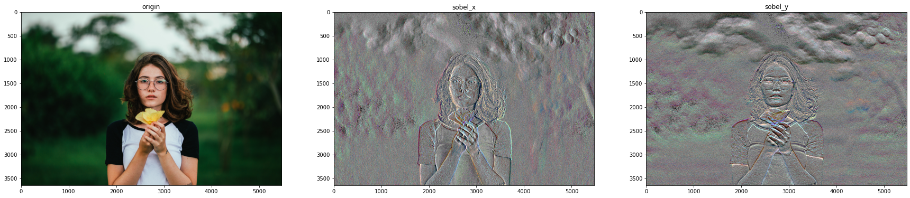

# **Linear Algebra and Applications**
# INTRODUCTION
  Tại sao một bức ảnh có thể xoay các chiều khác nhau được? 
  Làm thế nào để có thể tìm được các cạnh, biên trong một bức ảnh?
  Tại sao bạn có thể zoom một bức ảnh lên được??
  Làm thế nào để máy tính biết được chiều sâu của một bức ảnh như con người?...........
  Hôm nay mình học được một số phương pháp để giải thích cơ bản những câu hỏi trên và rất bất ngờ khi câu trả lời từ những kiến thức toán học bạn học suốt thời thanh xuân tưởng như vô nghĩa :)).
# Nội Dung
Mình sẽ trình bày về 5 phần sau:
1. Derivative/Gradient
2. Interpolation
3. Vector and Matrix
4. Cosine Similarity
5. Integral

# 1. Derivative/Gradient
  - Đạo hàm? Chắc bạn đang nghĩ mình đang nghĩ về thời cấp 3, năm 1, 2 đại học, thứ mà làm bạn tốn rất nhiều giấy và mực, giờ có khi như một bóng mờ trong bạn, khá là mơ hồ :)). Nhưng ở đây mình không nói về các bài toán đạo hàm siêu to dắc dối mà bạn từng học, mà là một ứng dụng nhỏ rất thú vị của đạo hàm, đó là tìm cạnh của bức ảnh.
  
  - Có thể hiểu đạo hàm tại một điểm là tiếp tuyến tại điểm đó, Áp dụng cho hàm rời rạc ta có công thức sau:

  - Đây là công thức cơ bản nhất của đạo hàm, dựa vào đạo hàm mà ông sobel tạo ra dược thuật toán Sobel ứng dụng trong xử lí ảnh sau, khác biệt ở chỗ điểm lấy đạo hàm ông nhân với 2, điểm trước và sau điểm lấy đạo hàm ông cho giá trị là 1.
 
  - Ứng dụng đạo hàm cho edge detection


```python

import cv2
import numpy as np
import matplotlib.pyplot as plt

img = cv2.imread('girl.jpg', 1)
img = cv2.cvtColor(img, cv2.COLOR_BGR2RGB)
sobel_x = cv2.Sobel(img, cv2.CV_64F, 1, 0, ksize=5)
sobel_y = cv2.Sobel(img, cv2.CV_64F, 0, 1, ksize=5)

f, axes = plt.subplots(1,3, figsize=(30,10))
axes[0].imshow(img)
axes[0].set_title('origin')
axes[1].imshow(sobel_x)
axes[1].set_title('sobel_x')
axes[2].imshow(sobel_y)
axes[2].set_title('sobel_y')
plt.show()


```

    Clipping input data to the valid range for imshow with RGB data ([0..1] for floats or [0..255] for integers).
    Clipping input data to the valid range for imshow with RGB data ([0..1] for floats or [0..255] for integers).
    





# 2. Interpolation

 -  Nội suy có thể hiểu là suy ra từ những dữ liệu đã có rời rạc, nó giúp giải quyết những bài toán dự đoán...bạn có thể nhớ đến bài toán dự đoán giá nhà.
  Một số phương pháp nội suy:
  

-  Một ứng dụng rất phổ biến của nội suy là phóng to ảnh, tìm các giá trị mới ở ảnh phóng to từ ảnh gốc


```python
import numpy as np
import cv2

#read a color image
img = cv2.imread('flower.png')

#Get meta-data of the image
height, width, channels = img.shape

#new dimension
new_dim = (width*4, height*4)

#unsampling the image
resize_nearest = cv2.resize(img, new_dim, interpolation=cv2.INTER_NEAREST)
resize_bilinear = cv2.resize(img, new_dim, interpolation=cv2.INTER_LINEAR)
#save img
cv2.imwrite('resize_nearest.png',resize_nearest)
cv2.imwrite('resize_bilinear.png',resize_bilinear)

```


    True


# 3. Vector and Matrix
- Vector and Matrix là thứ rất quan trọng trong xử lí ảnh, khai phá dữ liệu... sau đây là một số công thức phép tính đơn giản cuản matran va vecto, bạn có thể đọc nhiều hơn tại: https://aivietnam.ai/courses/aisummer2019/lessons/dai-so-tuyen-tinh-co-ban/
 
- Code cộng hai vecto
- Nhân hai ma trận
- Matrix nhân vecto, ứng dụng xoay ảnh
 
 

 
# 4. Cosine Similarity
- Cosine similarity (cs) được dùng để đo mức độ giống nhau/tương đồng giữa hai vector, nó được sử dụng trong nhiều bài toán gợi ý.........
[!img1](https://github.com/NguyenDinhTiem/Linear_Algebra_and_Applications/edit/main/cosin.png)
- Stereo matching
Stereo matching là một lĩnh vực nghiên cứu trong computer vision, nhằm tính khoảng cách từ camera đến các object. Stereo matching dùng hệ thống gồm 2 camera (gọi là stereo camera) để bắt trước cặp mắt của con người trong việc tính khoảng cách.

- Thông tin về chiều sâu (hay khoảng cách tới các object) được ứng dụng rộng rãi trong xây dựng mô hình 3D, xe tự hành, và cho cả các ứng dụng khác trong computer visioin như tracking, detection, hay segmentation.


- Ngắn gọn thì nó bao gồm việc nhìn vào cùng một bức tranh từ hai góc độ khác nhau, tìm kiếm cùng một thứ trong cả hai bức tranh và suy ra chiều sâu từ sự khác biệt về vị trí. Cái này được gọi là stereo matching.

- Phát biểu bài toán: cho 2 ảnh trái và ảnh phải, với mỗi pixel p bên ảnh trái, tìm pixel tương ứng q bên ảnh phải. Biết rằng tọa độ dòng của 2 pixel bằng nhau (yp=yq) và tọa độ cột của q lệch trái tối đa là D (xq=xp–d với d∈[0,D]). Hình sau minh họa hai pixel tương ứng giữa cặp ảnh trái và phải.

- Phương pháp dựa vào pixel

Theo ý hiểu của mình thì phương pháp này như sau:
Bước 1: Chọn 1 điểm trên ảnh trái L giả sử là A(23, 10) giá trị điểm này là 100, giờ bên ảnh phải mình cũng lấy 1 điểm B(23,10) giá trị điểm này là 110. Mặc dù 2 điểm cùng tọa độ, nhưng giá trị lại khác nhau, vì sao lại như vậy? Là do 2 hình nhìn như gống nhau nhưng do nhiều yếu tố như góc chụp, độ sáng.. nên có sự chênh lệch giá trị màu như vậy. Giả sử người ta tính toán và nói rằng mình cần dịch chuyển điểm B về bên trái khoảng (0-15 ô hay giá trị toạn độ theo x) thì sẽ tìm được đúng điểm đúng với điểm A ở bên trái. 
Bước 2: Tiếp theo mình mình dịch chuyển xB sang trái từ 1->15 đơn vị, mỗi lần dịch chuyển ta được 1 vị trí xB mới, mỗi xB có 1 giá trị màu khác nhau. Sau đó ta tính độ lệch tại 15 giá trị đó bằng cách lấy giá trị màu tại A - đi giá trị tại từng điểm vị trí xB lấy bình phương. Ta lấy arg min độ lệch của 15 vị trí ta tính bên trên, nếu vị trí nào mà có giá trị làm cho nhỏ nhất thì ta lấy vị trí đó
Bước 3: Sau bước trên mình thu được toạn độ xB mới có giá trị B(20,10) có giá trị 110 = A, chiều xâu sẽ xác định bằng xA- XB mới = 23-20=3, áp dụng tương tự cho các điểm ảnh còn lại.
Note: Nếu các điểm ảnh có trong B mà không có trong A thì không cần xét điểm ảnh đó nữa  


```python
from PIL import Image
import cv2

def stereo_matching_ssd(left_img, right_img, kernel_size, disparity_range):
   
    # đọc ảnh trái và ảnh phải, rồi chuyển sang ảnh grayscale
    left_img  = Image.open(left_img).convert('L')
    left      = np.asarray(left_img)
    
    right_img = Image.open(right_img).convert('L')
    right     = np.asarray(right_img) 
    
    # cho trước chiều rộng và chiều cao của ảnh
    height = 288
    width  = 384
    
    # tạo disparity map
    depth = np.zeros((height, width), np.uint8)   
    
    kernel_half = int( (kernel_size-1) / 2)
    scale = 255 / disparity_range
      
    for y in range(kernel_half, height-kernel_half):  
        print(".", end=" ")
        
        for x in range(kernel_half, width-kernel_half):
            
            # tìm j tại đó cost có giá trị min
            disparity = 0
            cost_min  = 65534
            
            for j in range(disparity_range): 
                ssd = 0
                ssd_temp = 0 
                
                for v in range(-kernel_half, kernel_half):
                    for u in range(-kernel_half, kernel_half):
                        ssd_temp = 255**2 
                        if (x+u-j) >= 0:
                            ssd_temp = (int(left[y+v, x+u]) - int(right[y+v, (x+u) - j]))**2 
                        ssd += ssd_temp         
                
                if ssd < cost_min:
                    cost_min = ssd
                    disparity = j
            
            # gán j cho cost_min vào disaprity map
            depth[y, x] = disparity * scale
                                
    # chuyển dữ liệu từ ndarray sang kiểu Image và lưu xuống file
    Image.fromarray(depth).save('disparity_map_ssd.png')
    
    # applyColorMap
    corr_map = cv2.applyColorMap(depth, cv2.COLORMAP_JET)
    Image.fromarray(corr_map).save('disparity_map_ssd_color.png')
    
if __name__ == '__main__':
    disparity_range = 16 # cho cặp ảnh Tsukuba
    kernel_size = 5
    stereo_matching_ssd("images/left.png", "images/right.png", kernel_size, disparity_range)
```

    . . . . . . . . . . . . . . . . . . . . . . . . . . . . . . . . . . . . . . . . . . . . . . . . . . . . . . . . . . . . . . . . . . . . . . . . . . . . . . . . . . . . . . . . . . . . . . . . . . . . . . . . . . . . . . . . . . . . . . . . . . . . . . . . . . . . . . . . . . . . . . . . . . . . . . . . . . . . . . . . . . . . . . . . . . . . . . . . . . . . . . . . . . . . . . . . . . . . . . . . . . . . . . . . . . . . . . . . . . . . . . . . . . . . . . . . . . . . . . . . . . . . . . . . . . . . . . . . . . . . . . . . . . . . . . . . . . . . . . . . . . . . 


```python
- Phương pháp dựa vào window
Tương tự phương pháp trên, thay vì tính 1 điểm thì tôi tính từng cửa sổ có kích thước 3x3 chẳng hạn. Phương pháp này sẽ xử lí tốt hơn phương pháp trên khi ảnh có nhiễu.


```


      File "<ipython-input-11-733f65fa17ac>", line 1
        - Phương pháp dựa vào window
                 ^
    SyntaxError: invalid syntax
    


```python
# aivietnam.ai
# sum-area table ; simple implementation
import numpy as np
from PIL import Image

def stereo_matching_ssd(left_img, right_img, kernel_size, disparity_range):
   
    # đọc ảnh trái và ảnh phải, rồi chuyển sang ảnh grayscale
    left_img  = Image.open(left_img).convert('L')
    left      = np.asarray(left_img)
    
    right_img = Image.open(right_img).convert('L')
    right     = np.asarray(right_img) 
       
    # cho trước chiều rộng và chiều cao của ảnh
    height = 288
    width  = 384
    
    # tạo disparity map
    depth = np.zeros((height, width), np.uint8)   
    
    kernel_half = int( (kernel_size-1) / 2)
    scale = 255 / disparity_range
    
    # build sum-area table for each disparity
    memory = np.ones((disparity_range, height, width))    
    for j in range(disparity_range):
        print(".", end=" ")
        
        data = np.ones((height, width))
        for y in range(kernel_half, height-kernel_half):
            for x in range(kernel_half, width-kernel_half):
                if (x - j >= 0):
                    data[y, x] = abs(int(left[y, x]) - int(right[y, x - j])) / 255.0
        
        # first item
        memory[j, 0, 0] = data[0, 0]
    
        # first row
        for y in range(1):
            for x in range(1, width):
                  memory[j, y, x] = memory[j, y, x - 1] + data[y, x]

        # first column
        for x in range(1):
            for y in range(1, height):
                memory[j, y, x] = memory[j, y - 1, x] + data[y, x]
                
        for y in range(1, height): 
            for x in range(1, width):
                memory[j, y, x] = memory[j, y, x - 1] + memory[j, y - 1, x] - \
                                  memory[j, y - 1, x - 1] + data[y, x]                     
    
    
    for y in range(kernel_half, height-kernel_half):        
        for x in range(kernel_half, width-kernel_half):
            
            x0 = x - kernel_half
            x1 = x + kernel_half                
            y0 = y - kernel_half
            y1 = y + kernel_half
                
            # tìm j tại đó cost có giá trị min
            disparity = 0
            cost_min  = 65534 # a large number            
            for j in range(disparity_range):
                a = memory[j, y0 - 1, x0 - 1]
                b = memory[j, y1, x0 - 1]
                c = memory[j, y0 - 1, x1]
                d = memory[j, y1, x1]
                ssd = d - b - c + a
                                
                if ssd < cost_min:
                    cost_min = ssd
                    disparity = j                  
            
            # gán j cho cost_min vào disaprity map
            depth[y, x] = int(disparity * scale)
                                
    # chuyển dữ liệu từ ndarray sang kiểu Image và lưu xuống file
    Image.fromarray(depth).save('disparity_map_ssd_ii.png')
    
    # applyColorMap
    corr_map = cv2.applyColorMap(depth, cv2.COLORMAP_JET)
    Image.fromarray(corr_map).save('disparity_map_ssd_ii_color.png')
    
disparity_range = 16 # cho cặp ảnh Tsukuba
kernel_size = 5
stereo_matching_ssd("images/left.png", "images/right.png", kernel_size, disparity_range)
```

    . . . . . . . . . . . . . . . . 

# 5. Integral


```python

```
